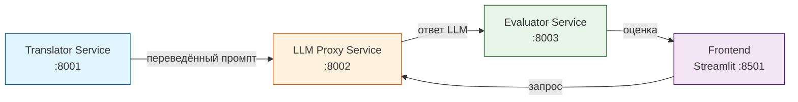

# LLM Proxy Service

Единый API-шлюз для доступа к российским и зарубежным LLM (YandexGPT, GigaChat, OpenAI) с единым интерфейсом.

## 🎯 Назначение

Сервис предоставляет унифицированный REST API для генерации ответов от различных языковых моделей.
Позволяет абстрагироваться от различий в API конкретных провайдеров.

## 🏗️ Архитектура

# Запуск сервера

```Terminal
make run
```

Ермолинская Александра Александровна
УрФУ, группа РИМ-150975к

# Режим без API-ключей (Mock)

## В файле .env укажите:

```
MOCK_MODE=true
```

## Или в коде generate.py временно замените провайдеров:

providers = {
"yandex": MockProvider(),
"gigachat": MockProvider(),
"openai": MockProvider()
}

# Проверка работоспособности

```bash

# Проверка здоровья
curl http://localhost:8002/health

# Список провайдеров
curl http://localhost:8002/api/v1/providers

# Тест генерации (Mock-режим)
curl -X POST http://localhost:8002/api/v1/generate/yandex \
  -H "Content-Type: application/json" \
  -d '{"prompt":"Скажи привет"}'
```


---

## Взаимодействие сервисов

 


## Лицензия

MIT

## Автор